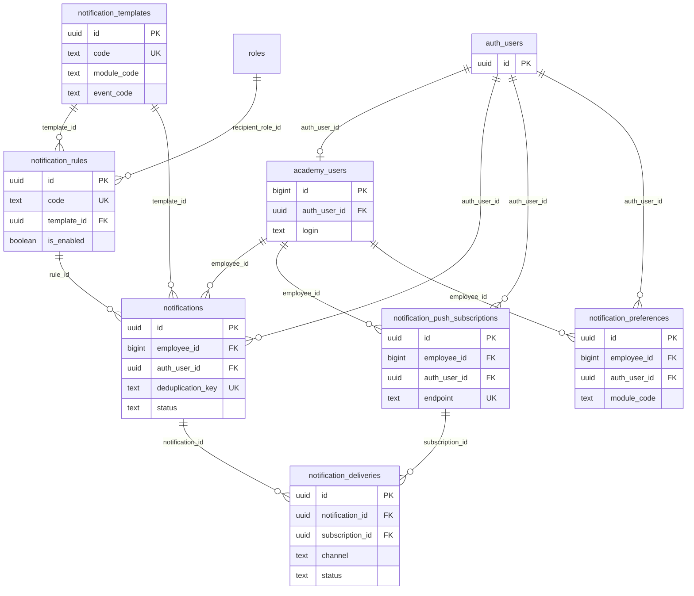

# Notification System — Database Foundation

Документ описывает SQL-миграцию `20260713194500_notification_system_foundation.sql`: схему универсальной системы уведомлений Shugyla Platform на этапе «фундамент» (без dispatcher, Web Push и Edge Functions).

## 1. Назначение таблиц

| Таблица | Назначение |
|---------|------------|
| `academy_users.auth_user_id` | Связь бизнес-профиля сотрудника с записью Supabase Auth для безопасного RLS |
| `notification_templates` | Универсальные шаблоны заголовков, текстов и action URL по модулям |
| `notification_rules` | Правила: когда, кому и через какие каналы отправлять уведомление |
| `notifications` | Конкретное уведомление конкретному сотруднику |
| `notification_push_subscriptions` | Web Push-подписки устройств (регистрация — на следующем этапе) |
| `notification_deliveries` | История попыток доставки по каналам и устройствам |
| `notification_preferences` | Пользовательские настройки каналов и quiet hours |

## 2. Связи между таблицами



## 3. Почему `academy_users.id` остаётся главным business ID

- Вся существующая доменная модель (смены, закуп, Academy, RBAC) уже ссылается на `academy_users.id bigint`.
- Уведомления, правила и настройки привязаны к **сотруднику как бизнес-сущности**, а не к UUID Supabase Auth.
- `auth_user_id` — дополнительный технический ключ для авторизации; он не заменяет `employee_id` в бизнес-логике и отчётах.

## 4. Почему `auth_user_id` необходим для RLS

Frontend не может безопасно доказать, что переданный `employee_id` принадлежит текущей сессии: значение можно подменить в запросе.

Политики RLS проверяют **`auth_user_id = auth.uid()`** и связь `academy_users.auth_user_id = auth.uid()` при операциях с подписками и настройками. Серверная логика (Edge Function / RPC с service role) при создании уведомлений копирует `auth_user_id` из профиля сотрудника на момент отправки.

## 5. Какие сотрудники пока не смогут получать push

Push-подписка требует:

1. Действующую Supabase Auth-сессию.
2. Заполненный `academy_users.auth_user_id`.

Без связи с `auth.users` сотрудник **не сможет**:

- зарегистрировать Web Push-подписку (RLS блокирует INSERT);
- читать свои уведомления через RLS (SELECT по `auth_user_id = auth.uid()`).

In-app уведомления в UI также станут доступны только после backfill и успешного входа через Supabase Auth.

## 6. Как работает backfill `auth_user_id`

Функция `notification_login_to_technical_email(login)` повторяет логику `loginToTechnicalEmail()` из `src/utils/phoneUtils.js`:

| Вход `login` | Технический email |
|--------------|-------------------|
| Уже содержит `@` | `lower(login)` как есть |
| Телефон `7XXXXXXXXXX` (после нормализации) | `{phone}@shugyla.local` |
| Текстовый login (`admin`, и т.д.) | `{login}@shugyla.local` |

Backfill обновляет `auth_user_id` **только если**:

- поле ещё `NULL`;
- technical email вычисляется однозначно;
- ровно **один** `auth.users` совпадает по `lower(email)`;
- этот auth user не привязан к другому сотруднику.

Backfill **не**:

- перезаписывает существующий `auth_user_id`;
- создаёт `auth.users`;
- меняет email, login или пароль.

Диагностические запросы — в конце файла миграции (комментарии, секция 10).

## 7. Формирование `deduplication_key`

Стабильный ключ предотвращает дубли при повторных срабатываниях правила. Формат (рекомендуемый):

```
{module_code}:{event_code}:employee_{employee_id}:{context}:{attempt_label}
```

Пример:

```
time_tracker:clock_in_missing:employee_15:shift_827:first_reminder
```

Компоненты:

- `module_code` + `event_code` — тип события;
- `employee_id` — получатель;
- `context` — ID смены, задачи и т.д.;
- `attempt_label` — метка попытки (`first_reminder`, `second_reminder`).

Ключ уникален на уровне таблицы (`UNIQUE`).

## 8. Почему `action_url` без домена и base path

`action_url` хранится как **относительный маршрут приложения**, например `/platform/time-tracker`.

Причины:

- приложение работает на GitHub Pages (`/shugyla-academy/`) и может переехать на собственный домен;
- service worker при показе push сам соберёт полный URL из `origin` + scope + `action_url`;
- в БД не попадают устаревшие домены и лишние префиксы.

Ограничение CHECK: значение `NULL` или начинается с `/`, но не с `//`.

## 9. Таблицы, доступные frontend (authenticated + RLS)

| Таблица | SELECT | INSERT | UPDATE | DELETE |
|---------|--------|--------|--------|--------|
| `notifications` | Свои (`auth_user_id = auth.uid()`) | — | — | — |
| `notification_push_subscriptions` | Свои | Свои (с проверкой `academy_users`) | Свои | Свои |
| `notification_preferences` | Свои | Свои | Свои | — |

### Table privileges (SQL GRANT vs RLS)

PostgreSQL проверяет **два независимых уровня**:

1. **SQL privilege (GRANT/REVOKE)** — может ли роль вообще обращаться к таблице (`SELECT`, `INSERT`, …).
2. **RLS policy** — какие **строки** доступны при наличии SQL privilege.

Правила для notification tables:

| Роль | Доступ |
|------|--------|
| `anon` | **Нет** прямого SQL-доступа ко всем 6 таблицам уведомлений |
| `authenticated` | Только минимальные grants: `notifications` SELECT; push subscriptions SELECT/INSERT/UPDATE/DELETE; preferences SELECT/INSERT/UPDATE |
| `service_role` | Полный server-side доступ ко всем 6 таблицам (только backend / Edge Function, не frontend) |

Важно:

- **Отсутствие RLS policy** блокирует строки даже при наличии SQL privilege (кроме `service_role`, который RLS обходит).
- **Отсутствие SQL privilege** даёт `permission denied for table …` **до** проверки RLS — политика `notifications_select_own` бесполезна без `GRANT SELECT`.
- Широкие grants на `notification_templates`, `notification_rules`, `notification_deliveries` для `authenticated` **не выдаются** — управление ими только server-side.

Секция `8b. Table privileges` в миграции явно задаёт `REVOKE ALL` + минимальные `GRANT`.

### Private RLS ownership helper

RLS-политики `notification_push_subscriptions` и `notification_preferences` должны проверить, что `employee_id` принадлежит текущему Supabase Auth-пользователю через связь в `academy_users`.

**Проблема прямого подзапроса:** политика выполняется с правами `authenticated`. У этой роли **нет** `SELECT` на `public.academy_users` (намеренно — широкий grant открыл бы лишние данные при существующих permissive-политиках на `academy_users`).

**Решение:** функция `notification_private.employee_owned_by_current_auth(bigint)`:

| Свойство | Значение |
|----------|----------|
| Схема | `notification_private` (не exposed через Data API) |
| Тип | `SECURITY DEFINER`, `STABLE`, `LANGUAGE sql` |
| `search_path` | `''` (пустой, все relation names schema-qualified) |
| Аргумент | только `employee_id bigint` (не `auth_user_id`) |
| Возврат | `boolean` — без ФИО, login, role и других полей |
| Владелец | `postgres` (не `anon` / `authenticated`) |

**Права:**

- `REVOKE ALL` + `REVOKE EXECUTE` для `PUBLIC` и `anon`;
- `authenticated`: `USAGE` на схему + `EXECUTE` на функцию;
- `GRANT SELECT ON academy_users TO authenticated` **не выдаётся**.

Политики subscriptions/preferences проверяют **оба** условия:

1. `auth_user_id = auth.uid()`
2. `notification_private.employee_owned_by_current_auth(employee_id)`

**Production deployment:** перед применением в production убедиться, что `notification_private` **не добавлена** в exposed schemas Data API проекта (в локальном `config.toml`: только `public`, `graphql_public`).

### Mark notification read RPC

Отметка «прочитано» без `GRANT UPDATE` на `notifications` для `authenticated`:

| Уровень | Функция | Роль |
|---------|---------|------|
| Публичный RPC | `public.mark_notification_read(p_notification_id uuid)` | `SECURITY INVOKER` — exposed через Data API |
| Приватная логика | `notification_private.mark_notification_read_internal(p_notification_id uuid)` | `SECURITY DEFINER` — не exposed |

**Почему двухуровневая конструкция:**

- `SECURITY INVOKER` wrapper не может выполнить `UPDATE notifications` без SQL privilege UPDATE у вызывающего.
- Реальный `UPDATE` выполняет private `SECURITY DEFINER` под правами владельца (`postgres`).
- `authenticated` сохраняет только `SELECT` на `notifications`; прямой UPDATE и UPDATE policy **не добавляются**.

**Контракт RPC:**

- Аргумент: только UUID уведомления (не `auth_user_id`, не `read_at`).
- Владелец определяется через `auth.uid()` внутри private function.
- Возвращает `boolean`: `true` — своё уведомление найдено и считается прочитанным; `false` — NULL id, не авторизован, не найдено или чужое (без раскрытия существования чужого UUID).
- Идемпотентность: если `read_at` уже установлен — возвращает `true`, не меняет `read_at` и `updated_at`.
- При первом прочтении: устанавливает только `read_at = now()` (триггер обновит `updated_at`).
- **Не меняет** `status`, `title`, `body`, `metadata` и другие поля.
- `anon` не имеет `EXECUTE` на public RPC.

Frontend вызывает:

```javascript
await supabase.rpc('mark_notification_read', { p_notification_id: notificationId })
```

UI-центр уведомлений (колокольчик, список, optimistic read): [in-app-notification-center.md](./in-app-notification-center.md).

## 10. Таблицы только server-side

| Таблица | Причина |
|---------|---------|
| `notification_templates` | RLS включён, политик для пользователей нет |
| `notification_rules` | RLS включён, политик для пользователей нет |
| `notification_deliveries` | Аудит и обработка доставки; RLS без политик |

Управление шаблонами и правилами — через админ-backend или RPC с service role (не из anon-клиента).

## 11. Будущая Edge Function (dispatcher)

Ожидаемый цикл работы:

1. **Cron / scheduled trigger** находит смены и события (time tracker).
2. **Dispatcher** читает включённые `notification_rules`, вычисляет получателей и `scheduled_for`.
3. Создаёт строки в `notifications` с `deduplication_key`, `auth_user_id` из `academy_users`.
4. Учитывает `notification_preferences` (каналы, quiet hours; критические правила могут игнорировать отключение).
5. Создаёт `notification_deliveries` для каждого канала/устройства.
6. Для `push` — отправка через Web Push API и обновление статусов.
7. Для `in_app` — статус `delivered` / Realtime при необходимости.

## 12. Что ещё не реализовано

- Web Push в service worker (`push`, `notificationclick`).
- Регистрация подписок из frontend.
- Edge Functions и Cron.
- Dispatcher и вычисление получателей по `recipient_type`.
- RPC `mark_notification_read`.
- UI центра уведомлений.
- Upsert логики для повторной регистрации endpoint.
- Включение seed-правил (`is_enabled = false` намеренно).

## 13. ON DELETE — принятые решения

| FK | Поведение | Обоснование |
|----|-----------|---------------|
| `notifications.employee_id` → `academy_users` | `CASCADE` | Уведомления — производные данные профиля; при редком удалении сотрудника не нужны «висячие» записи |
| `notifications.auth_user_id` → `auth.users` | `SET NULL` | Legacy-строки остаются привязаны к `employee_id`; RLS скрывает их без auth |
| `notification_deliveries.notification_id` | `CASCADE` | История доставки не имеет смысла без родительского уведомления |
| `notification_deliveries.subscription_id` | `SET NULL` | История push-попыток сохраняется после отписки устройства |
| `notification_push_subscriptions.auth_user_id` | `CASCADE` | Подписка без auth user недействительна |

Сотрудники в платформе обычно **деактивируются**, а не удаляются; `CASCADE` на `employee_id` срабатывает только при фактическом DELETE.

## 14. Seed-данные (time tracker)

Шаблоны:

- `time_tracker.shift_start_soon`
- `time_tracker.clock_in_missing`
- `time_tracker.shift_end_reached`
- `time_tracker.clock_out_missing`

Правила (коды `time_tracker.rule.*`): все **`is_enabled = false`** до появления dispatcher и push-инфраструктуры.

## 15. Local verification

Повторяемая локальная проверка миграции (backfill, RLS, CHECK constraints, `updated_at`, ON DELETE):

```bash
npm run supabase:local:verify-notifications
```

**Предварительно:** локальный Supabase должен быть запущен (например, через `npm run supabase:local:bootstrap -- --reset`).

Скрипт `scripts/verify-notification-foundation.mjs`:

- работает **только** с локальным Supabase (`127.0.0.1` / `localhost`);
- проверяет отсутствие remote link и production ref;
- создаёт **временных** auth-пользователей и `academy_users` только в локальной БД;
- выполняет runtime RLS-тесты через Data API с JWT тестовых пользователей;
- проверяет 25 CHECK constraints, 5 `updated_at` triggers и ON DELETE;
- **не отправляет** Web Push (endpoint — фиктивные локальные URL);
- удаляет все тестовые данные в `finally`, даже при падении теста;
- **никогда** не подключается к production Supabase.

Рекомендуемый порядок после bootstrap:

```bash
npm run supabase:local:bootstrap -- --reset
npm run supabase:local:verify-notifications
```

---

Миграция: `supabase/migrations/20260713194500_notification_system_foundation.sql`
